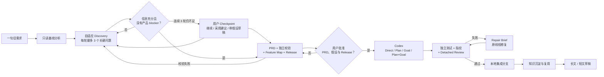

# OnePTeam

OnePTeam 是一个面向软件产品的 **AI 产品定义、Codex 工程交付与工程知识复用平台**。

用户只需要给出一句话需求。OnePTeam 会先理解现有代码库、澄清真正影响产品方向的问题，形成可审核的完整 PRD、Feature Map 和当前 Release；只有用户明确批准后，系统才把获批功能交给本地 Codex App Server 实现，并用独立测试、代码指纹和 Detached Review 验证结果。执行中的决策、失败和解决方法会进入结构化知识账本，还可以进一步生成适合微信公众号和小红书的技术文章草稿。

> 核心边界：**PRD 与当前 Release 获批前，OnePTeam 不创建执行工作树，也不写入产品代码。** Codex 自报完成、Goal 完成或预跑测试通过，都不能替代 OnePTeam 的最终验收。

## OnePTeam 解决什么问题

普通编码 Agent 擅长“把任务做完”，但一句话需求通常还不是一个可交付的产品定义。OnePTeam 在 Codex 前后增加了三层长期价值：

- **编码前的产品定义**：把模糊想法转化为目标用户、核心问题、产品定位、Feature、范围、非范围、验收标准和成功指标。
- **编码后的独立验收**：不采信 Agent 自报结果，由 OnePTeam 独立计算 diff、运行质量门、发起只读 Review，并在失败时驱动原线程修复。
- **跨项目的知识复利**：把真实决策、失败、根因、修复与适用条件结构化保存，在后续项目的 Discovery、Plan、Repair 和 Goal 停滞时作为带来源的先验建议。

不同模型承担不同职责：

| 职责 | 当前实现 | 是否可换其他模型 |
| --- | --- | --- |
| 产品发现与 PRD | LiteLLM 产品模型 | 可以，配置任意受支持 provider |
| 工程实现与修复 | 本地 Codex App Server | 不可以替换执行内核；可选择 Codex 当前可用模型 |
| 技术文章生成 | 独立 Article Model Profile | 可以，支持 LiteLLM provider 和 OpenAI-compatible endpoint |

OnePTeam 本身不附带模型额度或凭据。工程执行可以复用本机已有的 Codex 登录，也可以让 Codex 从指定环境变量读取 API Key；产品模型和文章模型分别配置、分别计费。

## 完整工作流



项目主状态为：

```text
idea → discovery → prd_review → ready → executing
     → verifying → knowledge_distilling → delivered
```

执行过程中还可能进入 `paused`、`blocked` 或 `stopped`。产品范围变化不会通过普通 Codex 对话直接生效，而是生成 `ChangeProposal` 和新 PRD 版本，重新审批后再执行。

## 已实现能力

### Product Studio

- 新产品与现有仓库共用同一个 Discovery 入口。
- 对已有仓库执行有界、只读的 Current Product Baseline 分析。
- 每轮根据完整问答和上一轮 Assessment，自适应提出 1–3 个会实质影响产品定位、产品规则或 Release 范围的问题，而不是固定只问三个问题。
- 用目标用户、核心问题、主场景、价值主张、产品范围、首发边界、成功指标和约束八个基础维度判断信息充分度；权限、隐私、支付、迁移、外部集成和多租户会按需求触发附加风险维度。
- 只有完整度达到 80%、必需维度已确认、没有高影响未决决定或冲突时才生成 PRD；连续三轮仍不足会进入用户 Checkpoint，不会无限自动追问。
- Checkpoint 允许继续澄清、明确采用模型建议，或生成带显式假设的草稿；高风险假设必须在批准前处理。
- 生成不可变 PRD 版本后再独立校验定位、范围、Feature、Release 和验收可测性；blocker 会返回 Discovery，不能直接批准。
- 生成 Feature Map 和建议首发 Release，并保留完整 Discovery、Assessment、假设与验证追溯。
- 明确审批 PRD 版本及本次要实现的 Feature。
- 将获批 Feature 编译成带依赖关系的 ExecutionUnit DAG。
- 用 `ChangeProposal` 管理执行期间的产品需求变化。
- 所有重要写操作支持 action ID 幂等；可编辑资源使用 revision/version 防止并发覆盖。

### Codex 工程执行

工程后端只有本地 `codex app-server --listen stdio://`，不存在 SDK transport、Legacy runtime 或静默降级路径。执行前会验证 Codex 认证、配置模型与 Plan collaboration mode；关键能力缺失时项目进入 `blocked`，不会先改代码再报错。

OnePTeam 会自动选择策略，并允许用户在 Feature 启动前覆盖：

| 策略 | 适用场景 |
| --- | --- |
| `direct` | 边界清晰、影响局部、验收可直接验证 |
| `plan_then_execute` | 跨模块、API、Schema、架构、安全或依赖关系复杂 |
| `goal` | 需要反复测量、长期运行或定量收敛 |
| `plan_then_goal` | 同时存在架构不确定性与长期收敛要求 |

每个 Feature 使用一个持久 Codex 根线程，修复继续原线程。Plan 阶段只规划、不修改代码；最终 Plan 会编译为有界 DAG。Goal 只保存 FeatureSpec 的短投影，Goal 完成不会跳过验收。

### 独立交付门

每个 Release 使用持久 integration worktree，每个 ExecutionUnit 使用隔离分支。Codex 结束后，OnePTeam 会：

1. 独立计算候选 diff 与代码指纹。
2. 依次运行 Feature 配置的聚焦、作用域和完整质量门；未配置时按项目清单发现测试命令。
3. 启动与实现线程分离的只读 Detached Review。
4. 把测试失败或 P0/P1 blocker 编译成 Repair Brief，最多进行三轮修复。
5. 全部门通过后本地提交，并 cherry-pick 到 OnePTeam integration 分支。

系统不会自动 push、合并到用户分支、部署，或执行其他外部副作用。Codex 运行在当前任务 worktree 的 `workspaceWrite` 沙箱中，默认关闭网络；技术问题与权限请求会持久化到 Web，等待用户处理。

### 工程知识账本

知识账本记录 `problem`、`hypothesis`、`decision`、`experiment`、`failure`、`discovery`、`resolution`、`pattern` 和 `principle`，并明确区分观察事实、模型推断与人工决定。

每条记录可以追溯到 Project、PRD、Feature、Release、ExecutionUnit、Codex thread/turn、Evidence 和代码指纹。历史知识被注入新项目时会创建 `KnowledgeApplication`，记录它最终是 `helped`、`irrelevant` 还是 `contradicted`；已反驳或过期的记录默认不会继续作为有效建议。

原始命令输出保存在有界、无公开 API 的 Artifact 中，知识记录只保留必要摘要。当前版本已启用同步结构化采集和跨项目检索，但**不会未经额外授权把工程证据自动发送给外部“知识提炼模型”**。

### Article Studio

文章工作室支持从单个或多个项目生成：

- 约 2500–4500 中文字的微信公众号长文；
- 约 600–1000 中文字的小红书短文，并附标题候选与话题建议。

两种稿件从同一事实大纲生成，短文不是长文截断。固定流程为：选择项目 → 推荐相关知识 → 用户调整素材 → 生成脱敏 SourcePack → 用户确认 → 双稿生成 → 编辑、版本化、局部重写或导出。

Article Model 只能读取用户确认的脱敏素材包，没有代码写入、Shell 或仓库访问能力。ClaimMap 会把关键结论映射到 KnowledgeRecord/Evidence；缺少来源的结论会标记为待确认。导出前再次进行隐私扫描，高风险内容会阻止导出。

## 环境要求

- Python 3.12+
- Git
- 本地 Codex CLI，并完成认证
- 一个 LiteLLM 兼容模型，用于产品发现和 PRD
- Node.js 仅在修改或重建 Web 前端时需要

目标代码库必须是本地目录。已有 Git 仓库在执行前必须保持工作树干净；新产品未提供仓库路径时，OnePTeam 会先分配未来目录，只在批准 Release 后初始化 Git 和执行工作树。

## 快速开始

```bash
git clone git@github.com:gynnash/OnePTeam.git
cd OnePTeam

python -m venv .venv
source .venv/bin/activate
python -m pip install -e .

onep --version
codex --version
codex login
```

配置产品分析模型后启动 Web：

```bash
export DEEPSEEK_API_KEY="your-key"
onep web
```

打开 <http://127.0.0.1:8311>。`onep web` 会同时启动本地 API 和后台 Worker；当前 Web 是无账号的本地单用户应用，因此只允许绑定到 `127.0.0.1`、`localhost` 或 `::1`。

## 配置

首次启动会创建 `~/.onep/config.yaml`。建议把产品模型密钥放在环境变量中，不要直接写入 YAML：

```yaml
llm:
  default_model: deepseek/deepseek-chat
  default_provider: deepseek
  complex_model: openai/gpt-5.5
  complex_provider: openai
  models:
    deepseek:
      api_base: https://api.deepseek.com/v1

project:
  root_dir: ~/.onep

execution:
  codex_model: gpt-5.6-terra
  codex_provider: ""
  codex_auth_mode: existing
  codex_api_key_env: OPENAI_API_KEY
  codex_bin: codex
  codex_approval_policy: on-request
  codex_request_timeout_seconds: 30
  codex_app_server_timeout_seconds: 3600

web:
  host: 127.0.0.1
  port: 8311
```

产品模型环境变量名由 provider 转为大写前缀，例如：

```bash
export DEEPSEEK_API_KEY="..."
export DEEPSEEK_API_BASE="https://api.deepseek.com/v1"
```

Codex 支持两种认证方式：

- `codex_auth_mode: existing`：复用本机 Codex 已有登录。
- `codex_auth_mode: api_key`：从 `codex_api_key_env` 指定的环境变量读取密钥，并交给本地 Codex App Server 登录；OnePTeam 不把密钥写入数据库。

文章模型不读取上述产品模型配置。请在 Web 的“设置”页面创建、测试、修改或停用 Article Model Profile；明文凭据只写入操作系统 keyring，API、日志和 SQLite 都不会返回明文。

启动后可在“设置”中点击“验证 Codex 能力”，确认认证、模型、Plan、Goal、Detached Review、Skill、结构化输出、流式事件和交互能力已就绪。

## Web 使用流程

Web 是主产品界面，导航包括首页、项目、运行、知识、文章和设置。

1. 点击“定义新产品”，输入一句话需求；已有项目可同时填写本地仓库路径。
2. 在 Conversation 按轮回答 Discovery 问题；系统每轮重新显示完整度、维度覆盖、冲突和下一组关键问题。
3. 如果进入 Checkpoint，选择继续澄清、采用系统建议，或生成带明确假设的 PRD 草稿。
4. 在 PRD 页面处理独立校验 blocker 和高风险假设，并通过反馈生成新的不可变版本。
5. 在 PRD 和 Feature Map 检查产品定位、范围、验收与指标。
6. 选择当前 Release 的 Feature；必要时覆盖其 Codex 策略。
7. 批准指定 PRD 版本。后台 Worker 从此时才获得创建执行工作树和修改代码的权限。
8. 在 Build、Verification 和运行页查看 Plan、Goal、事件、测试、Review 与 Repair。
9. Codex 请求输入或权限时，在项目页处理持久化 InteractionRequest。
10. 在 Knowledge 检查本次决策、失败和跨项目复用结果。
11. 在 Article Studio 选择项目与记录，确认脱敏素材后生成、编辑和导出双稿。

## CLI

CLI 是 Web 的辅助入口，不提供完整的文章素材选择、凭据配置或文章编辑体验。

```bash
# Web
onep web [--host 127.0.0.1] [--port 8311]

# Product Studio
onep project new --idea "让团队从一句话形成 PRD 并可靠交付" [--repo /path/to/repo] [--name NAME]
onep project show PROJECT_ID
onep project answer PROJECT_ID --answer 'QUESTION_ID=答案' [--answer 'QUESTION_ID=答案']
onep project discovery-decision PROJECT_ID --action continue|accept-recommendations|draft-with-assumptions [--reason TEXT]
onep project approve-prd PROJECT_ID --version 1 [--feature FEATURE_ID] [--reason TEXT]
onep project strategy PROJECT_ID FEATURE_ID --mode auto|direct|plan|goal|plan-goal [--reason TEXT]
onep project pause PROJECT_ID
onep project resume PROJECT_ID
onep project stop PROJECT_ID

# Knowledge
onep knowledge search "缓存超时" [--limit 10]

# Article Studio
onep article list
onep article show ARTICLE_ID
onep article export ARTICLE_ID --platform long|short --format markdown|html|text [--output FILE]
```

`onep project approve-prd` 会在 CLI 进程中批准并直接执行 Release；Web 版本会提交后台 Job。未显式指定 `--feature` 时使用 PRD 建议的 `release_feature_ids`。

## API v2

Web 只挂载 `/api/v2`。主要资源包括：

- `/api/v2/projects`、`/studio`、`/discovery`、`/discovery/answers`、`/discovery/decision`
- `/api/v2/projects/{id}/prd/{version}/feedback|revalidate|approve`、`/assumptions/{id}/resolve`、`/changes`
- `/api/v2/interactions/{id}/resolve`、`/runtime/jobs`、`/events`
- `/api/v2/knowledge/search`、`/knowledge/records`、`/knowledge/relations`
- `/api/v2/articles`、`/source-suggestions`、`/source-packs`、`/regenerate`、`/export`
- `/api/v2/settings/article-models`、`/api/v2/settings/runtime/test`

写接口使用 `X-Action-ID` 保证幂等；PRD 使用不可变 version，文章、知识记录、素材包和模型 Profile 使用 revision/version 检测并发冲突。错误统一返回稳定的 `Problem` 结构。

完整接口与状态约束见 [docs/API_V2.md](docs/API_V2.md)。

## 数据与安全边界

默认运行数据位于 `~/.onep/`：

```text
~/.onep/
├── config.yaml          # 产品模型、Codex 与本地 Web 配置
├── studio.db            # 产品、PRD、Release、证据、知识与文章事实源
├── control.db           # 后台 Job、Worker 心跳和运行事件
├── workspaces/          # 未指定 repo 时分配的产品工作目录
└── studio-worktrees/    # Release integration 与 ExecutionUnit 工作树
```

安全默认值：

- 工程执行只使用本地 Codex App Server，不读取或修改 Codex 源码。
- Codex 只能写当前 ExecutionUnit worktree，默认禁止网络。
- Plan 阶段明确禁止代码写入；Detached Review 使用只读沙箱。
- 测试命令通过受限 argv 执行，不经过 Shell。
- 产品审批、运行时权限和产品变更是不同类型的决策，互不替代。
- 不自动 push、合并、部署、发布文章或执行外部副作用。
- 发送给产品模型、Codex 的历史知识和 Article Model 的素材都有数量、长度与脱敏边界。
- 密钥、Token、邮箱、绝对路径和内网地址会在模型调用、事件与文章导出边界进行扫描或替换。

新版不会迁移或读取旧数据库和旧 `.onep` 运行记录，也没有灰度、双写或旧工作流回退开关。

## 开发与验证

安装开发依赖并运行后端测试：

```bash
python -m pip install -e ".[dev]"
pytest -q -p no:cacheprovider
```

前端开发和验证：

```bash
cd onep/web/ui
npm install
npm run dev
npm run typecheck
npm test
npm run build
```

`npm run build` 会更新由 Python 包直接提供的 `onep/web/ui/dist` 静态资源。发布基线和手工验收场景见 [docs/TESTING.md](docs/TESTING.md)。

## 代码结构

```text
onep/
├── studio/          # Product Studio、知识账本、隐私与 Article Studio
├── runtime/         # Codex App Server stdio 客户端、协议适配与交付契约
├── delivery/        # 独立代码指纹
├── application/     # 能力注册、后台执行与设置边界
├── execution/       # Worker
├── infrastructure/  # control.db 持久化
├── web/             # FastAPI API v2 与 React Web
└── cli/             # 精简辅助 CLI
```

## 进一步阅读

- [Product Studio 架构](docs/PRODUCT_STUDIO_ARCHITECTURE.md)
- [知识账本与 Article Studio](docs/KNOWLEDGE_AND_ARTICLE_STUDIO.md)
- [API v2](docs/API_V2.md)
- [验证与测试基线](docs/TESTING.md)
- [Codex App Server 集成](docs/architecture/codex-app-server-integration.md)
- [交付契约](docs/architecture/delivery-contract.md)
- [证据账本](docs/architecture/evidence-ledger.md)
