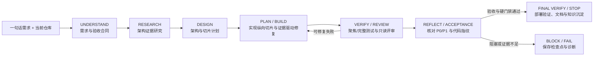

# OnePTeam

OnePTeam 是一个面向通用软件开发的自主 Agent。用户提供一句自然语言需求后，
系统会分析仓库现状，扩展产品需求和验收标准，研究可复用架构，规划纵向切片，
完成代码、测试、评审和修复，并在确定性质量闸门全部通过后生成交付文档。

它既能在空仓库中从零构建应用，也能根据新需求修改已有代码；对于没有明确产品
需求的存量仓库，还提供独立的代码分析和自动优化流程。

## 核心能力

- 一句话需求扩展为 PRD、验收合同、架构决策和实施计划
- 自动识别 Greenfield、Mixed 和 Brownfield 工作场景
- 基于纵向切片批量实现功能，并对失败测试进行证据驱动修复
- 聚焦测试、完整测试、补丁范围、只读评审和部署验证等确定性门禁
- Git 分支隔离、断点续跑、成本预算、模型传输重试和运行审计
- 首次执行时进行外部开源架构研究；研究不可用时自动降级
- 以原始需求为默认交付边界，验收通过后停止，不静默扩展额外产品范围
- 将决策、实验、失败和洞察沉淀为项目知识与跨项目知识
- CLI 和本地 Web 控制台两种操作入口
- 独立的存量代码策略分析、交互式 Workbench 和自动优化流水线

## 工作方式

`onep create` 和 `onep run` 使用统一 Autonomous Development Harness：



Harness 负责模式路由、研究、反思、停止条件和知识沉淀；稳定的应用侧执行入口是
`onep.execution.kernel.ExecutionKernel`，当前由 `onep/greenfield` 中的共享工程
内核实现，负责验收合同、代码修改、测试、修复、评审、Git 提交和最终验证。
CLI 的 `onep create` 和 `onep run` 都通过与 Web 共用的 `ApplicationService` 调用
该流程；当前代码仍保留 `onep analyze` / `onep optimize` 的存量代码专用入口。

构建流程只实现用户给出的原始需求。P0/P1 验收项和硬门禁通过后，Harness 会直接
完成交付，不会再自动发现并加入新的产品功能；需要继续探索存量仓库的改进机会时，
应另行运行 `onep analyze` 或 `onep optimize`。

### 模式识别

| 仓库状态 | 需求 | 内部模式 | 行为 |
|---|---|---|---|
| 没有源代码 | 有需求 | Greenfield | 从 PRD、架构到代码完整构建 |
| 已有源代码 | 有需求 | Mixed | 以需求为目标分析差距，在现有代码上实现 |
| 已有源代码 | 无产品需求 | Brownfield | 发现并实施高价值优化；通常使用 `onep optimize` |

`onep status` 中的历史项目类型仍可能显示 `greenfield` 或 `brownfield`；真正的
统一 Harness 模式记录在项目的 `.onep/harness/run.yaml` 中。

## 环境要求

- Python 3.12 或更高版本
- Git，并且执行仓库位于具名分支而非 detached HEAD
- 至少一个兼容 LiteLLM 的模型 API
- 可选：Docker，用于容器部署验证
- 可选：Node.js 22.22+，仅用于开发 Web 前端或构建 JavaScript 项目
- 可选：`GITHUB_TOKEN`，提高首轮开源架构研究的 GitHub API 配额

## 安装

```bash
git clone https://github.com/gynnash/OnePTeam.git
cd OnePTeam

python -m venv .venv
source .venv/bin/activate
python -m pip install -e .

# 开发和运行 OnePTeam 自身测试时安装
python -m pip install -e ".[dev]"
```

也可以使用 Conda：

```bash
conda create -n onep python=3.13 -y
conda activate onep
python -m pip install -e ".[dev]"
```

验证安装：

```bash
onep --version
onep --help
```

## 配置模型

OnePTeam 会按阶段选择默认模型或复杂模型。API 密钥优先从环境变量读取，也可以
配置在 `~/.onep/config.yaml` 中。

在执行目录或 OnePTeam 仓库根目录创建 `.env`：

```dotenv
DEEPSEEK_API_KEY=sk-your-deepseek-key
DEEPSEEK_API_BASE=https://api.deepseek.com/v1

OPENAI_API_KEY=sk-your-openai-key
OPENAI_API_BASE=https://api.openai.com/v1

# 可选：供 Harness 的开源架构研究使用
GITHUB_TOKEN=github-token
```

首次运行会自动创建 `~/.onep/config.yaml`。常用配置如下：

```yaml
llm:
  default_model: deepseek/deepseek-chat
  default_provider: deepseek
  complex_model: openai/gpt-5.5
  complex_provider: openai
  models: {}
  pricing:
    deepseek/deepseek-chat:
      input: 0.14
      output: 0.28

project:
  root_dir: ~/.onep

pipeline:
  auto_approve: false
  max_retries: 3
  test_timeout: 300
  stage_output_tokens:
    analyzer: 2048
    strategy_architect: 8192
    optimize_developer: 8192
    code_reviewer: 4096

run_defaults:
  max_rounds: 100
  max_repairs_per_slice: 8
  max_cost: 0.0
  deploy_mode: verify
  non_interactive: false
  verbose: false

# 以下部分由对应模块直接读取，可以按需添加
web:
  host: 127.0.0.1
  port: 8311

knowledge:
  vault_root: ~/.onep/vault
```

当 `--max-cost` 大于 `0` 时，实际使用模型必须在 `llm.pricing` 中配置非零的
输入、输出价格；否则系统会拒绝启动，以避免预算形同虚设。`0` 表示不设成本
上限。

## 快速开始

### 1. 准备工作目录

OnePTeam 在当前 Git 工作树中直接开发。先进入目标目录并确保工作树干净：

```bash
cd /path/to/your/project
git status --short
```

如果当前目录还不是 Git 仓库，`onep create` 会初始化 Git，并为初始 README
创建提交。若已经是 Git 仓库，tracked 和 untracked 用户文件都必须先提交、
stash 或清理。

### 2. 创建并运行

```bash
onep create \
  "做一个支持登录、标签和全文搜索的个人知识库" \
  --name knowledge-base \
  --test-command "pytest -q" \
  --deploy-mode verify
```

系统默认立即启动自主循环。执行完成后，终端会打印需求覆盖情况、质量门禁、
运行分支和审计目录。

CLI 会同步等待本次构建结束；Web 控制台调用相同能力，但会把长任务加入持久化
后台队列。

如果只想初始化：

```bash
onep create "做一个命令行记账工具" -n ledger --no-run
onep run ledger
```

### 3. 查看状态和产物

```bash
onep status
onep show prd knowledge-base
onep show architecture knowledge-base
```

成功构建的代码位于终端输出的 `onep/greenfield-<run-id>` 分支。OnePTeam 不会
自动把该分支合并回启动时的基础分支，应先人工审阅，再按团队 Git 流程合并。

## `onep create` 参数

```text
onep create [OPTIONS] REQUIREMENT
```

| 参数 | 默认值 | 说明 |
|---|---:|---|
| `--name`, `-n` | 从需求生成 | 项目名称，也是后续 `run/status/show` 的引用名 |
| `--no-run` | false | 只初始化项目，不立即执行 |
| `--max-rounds` | 100 | 本次允许的最大工程轮次 |
| `--max-repairs-per-slice` | 8 | 每个切片最多修复次数 |
| `--max-cost` | 0 | 美元成本上限；0 表示不限 |
| `--test-command` | 自动发现 | 强制质量闸门，可重复传入 |
| `--deploy-mode` | `verify` | `verify`、`local` 或 `none` |
| `--non-interactive` | false | 遇到无法安全推断的问题时持久化阻塞信息，不询问终端 |
| `--verbose` | false | 显示更详细的模型、工具和诊断轨迹 |

多个测试闸门的写法：

```bash
onep create "为现有服务增加审计日志" -n audit \
  --test-command "pytest tests/unit -q" \
  --test-command "pytest tests/integration -q"
```

质量命令必须是单一、可直接执行的命令。出于安全和可复现性考虑，不接受管道、
重定向、命令替换或命令串联：

```bash
# 支持
--test-command "python -m pytest -q"
--test-command "npm run test"
--test-command "go test ./..."

# 不支持
--test-command "pytest -q | tail -n 20"
--test-command "npm test && npm run build"
--test-command "python report.py --output report_$(date +%F).md"
```

需要多步验证时，应将步骤写入仓库内的测试脚本或 Makefile，再把该脚本作为一个
安全命令调用。

### 自动发现的质量闸门

OnePTeam 会根据实际文件发现测试，而不是只看到某个依赖声明就假设测试存在：

- Python：存在 pytest 配置或真实测试文件时运行 `pytest -q`
- Ruff、Mypy：`pyproject.toml` 中存在对应配置时运行检查
- Node.js：发现有效的 `test`、`lint`、`typecheck`、`build` script
- Go：`go test ./...` 和 `go vet ./...`
- Rust：`cargo test` 和 `cargo clippy`
- Gradle：`./gradlew test`
- Maven：`mvn verify`

如果无法发现确定性闸门，命令会要求显式传入 `--test-command`。

### 部署模式

| 模式 | 行为 |
|---|---|
| `verify` | 验证 Docker 配置，构建并启动；Compose 验证后自动停止容器 |
| `local` | 构建并启动 Compose 服务，验证后保留本地服务运行 |
| `none` | 跳过部署验证 |

仓库不存在 `Dockerfile`、`compose.yaml` 或 `docker-compose.yml` 时，部署步骤自动
跳过。

## 中断、失败与续跑

所有关键状态都会持久化。发生模型断流、测试失败、预算耗尽或手动中断后，先查看
状态，再从最近的可靠检查点继续：

```bash
onep status
onep run knowledge-base
```

`onep run` 会通过 `run.resume` 能力读取 Harness 状态、验收合同、切片状态和 Git
运行分支，不需要重新执行 `onep create`。该命令当前不提供重新设置运行选项的
参数；`--stage` 只是旧流水线兼容提示，Harness 始终以持久化检查点为准：

```bash
onep run knowledge-base --stage architect
```

其他控制命令：

```bash
onep pause knowledge-base
onep resume knowledge-base
onep approve knowledge-base
onep reject knowledge-base "需要补充可测量的验收标准"
```

- `pause` 更新项目状态；前台任务需要立即中断时使用 `Ctrl+C`
- `resume` 将状态改回 running 并立即调用运行流程
- `approve` / `reject` 用于仍停在旧审批检查点的历史项目；统一 Harness 的正常
  流程不要求逐阶段人工审批

## 运行产物

### 目标仓库内

```text
<workspace>/
├── README.md                         # 完成时根据真实代码生成的使用说明
├── docs/
│   ├── PRD.md                        # 需求与可执行验收标准
│   ├── ARCHITECTURE.md               # 架构决策和研究证据
│   ├── IMPLEMENTATION_PLAN.md        # 纵向切片计划
│   └── CODE_GUIDE.md                 # 源码模块与入口说明
└── .onep/
    ├── state.yaml                    # 项目级恢复状态
    ├── harness/
    │   ├── run.yaml                  # 统一 Harness 状态
    │   └── flow-events.jsonl         # 状态机事件
    ├── greenfield/
    │   ├── acceptance.yaml           # 当前验收合同
    │   └── runs/<run-id>/
    │       ├── run.yaml
    │       ├── acceptance.yaml
    │       ├── events.jsonl
    │       ├── distillations.jsonl
    │       └── report.md
    └── knowledge/                    # 项目级知识笔记
```

`.onep/` 是运行时目录，会写入仓库本地的 `.git/info/exclude`，不会自动污染项目的
版本控制。

### 用户目录

```text
~/.onep/
├── config.yaml                       # 全局配置
├── meta.db                           # 项目、状态和历史元数据
├── memory/memory.db                  # 长期记忆数据库
├── vault/                            # 跨项目原则、模式和文章
└── projects/<name>/workspace/        # analyze/optimize 的托管工作区和审计记录
```

## 存量代码分析与自动优化

### 分析仓库

```bash
onep analyze ./repo --name repo-review --max-cost 5

# 分析远程仓库，不进入交互工作台，直接导出报告
onep analyze https://github.com/org/repo.git \
  --no-dialogue \
  --export ./repo-analysis.md

# 恢复分析
onep analyze ./repo --name repo-review --resume
```

`onep analyze` 的 Strategy 模式依次执行源码扫描、深度分析和交互式 Workbench。
`--from-layer 1|2|3` 可以从指定分析层开始。当前 `--mode code` 尚未实现，默认并
推荐使用 `--mode strategy`。

Workbench 常用命令：

| 命令 | 作用 |
|---|---|
| `/list` | 列出优化方向 |
| `/focus <n>` | 聚焦第 n 个方向 |
| `/search <keyword>` | 搜索方向 |
| `/plan <n>` | 生成标准实施 Plan |
| `/expand <n>` | 生成详细 Plan |
| `/approve <n>` | 审核 Plan |
| `/execute <n>` | 实现、测试并修复当前 Plan |
| `/compare <n> <m>` | 对比两个方向 |
| `/merge <n> <m>` | 合并方向 |
| `/discard <n>` | 丢弃方向 |
| `/rescan` | 重新扫描仓库 |
| `/export <file>` | 导出当前结果 |
| `/status` | 查看进度 |
| `/exit` | 保存并退出 |

恢复和导出 Strategy 会话：

```bash
onep strategy status repo-review
onep strategy resume repo-review
onep strategy export repo-review --format md
onep export repo-review --format json --output repo-review.json
```

### 全自动优化

```bash
onep optimize ./repo \
  --name repo-optimize \
  --max-rounds 5 \
  --auto-approve low,medium \
  --test-command "pytest tests/unit -q" \
  --integration-test-command "pytest -q" \
  --max-cost 20
```

`onep optimize` 要求源仓库位于具名分支且工作树完全干净。每个 Plan 在独立
branch/worktree 中实施，通过补丁范围、聚焦测试和只读评审后，再按依赖顺序合入
`onep/optimize-<run-id>` 集成分支并运行集成测试。它不会自动合并到原分支。

`--auto-approve` 指定可以自动执行的影响级别。默认是 `low,medium`；高影响改动不
会被静默执行。

## Web 控制台

```bash
onep web
onep web --host 127.0.0.1 --port 8311
```

浏览器打开 `http://127.0.0.1:8311`。控制台采用“任务运行中心”信息架构：全局提供
控制台、项目、任务、知识和设置五个入口；项目工作台按目标、计划、执行、验证和
交付生命周期组织。当前阶段、工作项和质量证据默认结构化展示，原始事件与 JSON
收纳在按需展开的检查器中。

右上角“新建任务”可选择“构建应用”“分析代码”或“自动优化”。后两者复用现有
`onep analyze` / `onep optimize` 算法，在受控后台进程中执行，并会把用户填写的
补充目标传给分析模型。运行中的外部流程可从任务中心取消；系统会终止对应进程组。

`onep web` 会同时启动 FastAPI 服务和独立 Worker。顶部连接状态同时检查 API、
SSE 和 Worker 心跳，不再用静态文案推测可用性。创建、续跑、文章生成等长任务
先写入 SQLite WAL 队列，再由 Worker 执行；刷新页面或 Web 进程重启不会丢失已排队
任务。页面通过 SSE 接收实时事件，并只在连接不可用时使用低频轮询兜底。同一个项目同一时刻只会
运行一个可写任务，重复请求通过 `X-Action-ID` 幂等键合并。

全局设置支持模型路由、测试超时和新运行默认值；项目设置可覆盖模型、预算、轮次、
部署模式和质量命令。项目设置只影响下一次启动或续跑，当前运行快照不可变。模型
密钥只显示“已配置/未配置”，不会由 Web API 返回；质量命令保存前会复用服务端
安全校验，并可从项目文件中自动发现。

Web 服务当前没有身份认证，默认仅监听 `127.0.0.1`。除非前面另有可信反向代理
和访问控制，否则不要绑定到公网地址。

开发 Web 前端：

```bash
cd onep/web/ui
npm ci
npm run dev

# 生成由 Python 包直接托管的静态资源
npm run build
npm run typecheck
npm test
```

前端使用 React 19、React Router 8（Hash Router）、TanStack Query、Zustand、
Radix、Tailwind CSS 4 和本地打包字体。组件、状态归属、视觉 token 与交互规范见
[`docs/WEB_DESIGN_SYSTEM.md`](docs/WEB_DESIGN_SYSTEM.md)。

Web 与 CLI 共用 `ApplicationService` 和显式 Capability Registry。高级集成或排障
时可以直接查看、调用同一能力合同：

```bash
onep capabilities
onep action project.list
onep action artifact.read \
  --project <project-id> \
  --payload '{"artifact":"prd"}'
```

正式 REST API 位于 `/api/v1`，包括能力发现、健康检查、项目查询、设置、动作执行、
Job 查询/取消和事件流。例如项目列表使用 `GET /api/v1/projects`，健康状态使用
`GET /api/v1/health`，通用能力调用使用
`POST /api/v1/actions/{capability_id}`。旧的未版本化项目读写路由已移除；仅知识和
事件的只读兼容路由暂时保留。默认仍只监听环回地址；当前版本是本地单用户产品，
不提供公网认证或多租户隔离。

## 知识与文章

Harness 会在切片、修复轮次和完成节点，把原始运行事件压缩为少量结构化知识：
问题、决策、实验、失败、发现和洞察。项目级笔记默认位于
`<workspace>/.onep/knowledge/`，可迁移知识默认位于 `~/.onep/vault/`。

完成一次 Harness 运行后，可以生成带推理关系图的知识文章：

```bash
onep article knowledge-base
```

长期记忆命令：

```bash
onep memory status
onep memory search "测试夹具冲突" --top 10
onep memory import repo-review
onep memory clean --older-than 90
```

当前 `onep memory import --all` 尚未实现；请按项目名逐个导入 Strategy Workbench
内容。

## 项目管理与只读查看

```bash
onep status

onep show prd PROJECT
onep show design PROJECT
onep show architecture PROJECT
onep show report PROJECT
onep show log PROJECT

onep delete PROJECT
onep delete PROJECT --keep-files
onep delete <project-id-prefix> --force
```

部分 `show` 子命令用于兼容旧六阶段流水线；如果当前 Harness 没有生成对应文档，
命令会明确显示 `not found`。`delete` 只会递归删除 `~/.onep/projects/` 下的托管
工作区；对于 `onep create` 就地使用的外部仓库，只删除 OnePTeam 数据库记录，
不会删除源代码。

## 安全与停止条件

OnePTeam 不以模型声称“完成”为交付依据。完成至少需要：

1. P0/P1 验收项全部通过；
2. 聚焦测试和完整质量命令成功退出；
3. 当前代码指纹与验证证据一致，代码变化后不能复用旧测试结果；
4. 风险策略要求时通过独立只读 Reviewer；
5. 没有阻塞项，且部署验证按配置完成；
6. 生成 README 和代码说明，并保存完整运行报告。

`onep create` / `onep run` 以原始需求为停止边界：验收合同和硬门禁全部满足后标记
成功；修复预算耗尽、成本超限、阻塞或确定性门禁失败时保存诊断并停止，用户也可
请求在下一个安全边界停止。`onep optimize` 的存量优化循环另外受最大轮次、候选
价值和边际收益控制。任何软停止条件都不能绕过硬门禁把项目标记为成功。

## 常见问题

### `ERROR [GIT_SAFETY] working tree is dirty`

OnePTeam 必须从可恢复的 Git 基线开始。查看并处理所有 tracked 和 untracked 文件：

```bash
git status --short
git add <files> && git commit -m "chore: save work"
# 或者在确认需要时使用 git stash -u
```

不要只处理 tracked 文件；未跟踪的 `config/`、`src/` 等目录同样会触发保护。

### `Unsafe/Unsupported quality gate command`

命令包含管道、重定向、`&&`、子命令替换，或不属于允许的测试/构建工具。把复杂
逻辑写入项目脚本或 Makefile，闸门只调用该单一入口。

### `pytest` 显示 `no tests ran`

这不是修复轮次不足，而是 pytest 没有发现测试。检查测试文件是否符合
`test_*.py` / `*_test.py` 命名，并确认测试目录没有与同名模块文件冲突。对于暂时
没有 pytest 测试的项目，不要把 `pytest -q` 作为成功标准；提供真实可执行的验收
命令。

### `scope_violation: Unexpected files`

实现产生了 Plan 未声明的文件。当前流程会将生产代码、测试、配置和必要依赖尽量
纳入切片范围，但模型仍可能偏离。查看日志中的 `Unexpected files` 和当前切片的
`expected_files`；续跑时 Reviewer 会基于该证据修复。不要通过随意扩大到整个仓库
来绕过范围门禁。

### `model_api_interrupted` / `MidStreamFallbackError`

这是模型流式连接中断，不代表代码逻辑失败。Harness 只对连接中断、限流或服务
不可用等传输类错误进行退避重试，且传输重试不消耗切片修复预算。普通工具或编排
异常不会被误判为网络问题：系统会保存当次 WIP、记录分类诊断并停止。连接恢复后
执行：

```bash
onep run PROJECT
```

### 找不到或无法恢复运行分支

不要手动删除 `onep/greenfield-*` 分支或 `.onep/` 状态。先运行 `git branch` 和
`onep status` 核对；如果分支已被删除，当前运行无法安全恢复，应从干净基础分支
重新创建项目记录。

## 代码结构

```text
onep/
├── main.py                 # Click CLI 入口和命令自动注册
├── cli/                    # create/run/analyze/optimize/web 等命令
├── domain/                 # 无框架依赖的 Job、Run、Problem 数据结构
├── application/            # CLI/Web 共用的能力注册与应用服务
├── infrastructure/         # SQLite WAL 事件库和持久任务队列
├── execution/              # 稳定 ExecutionKernel 入口、租约、心跳和恢复 Worker
├── harness/                # 统一需求编排、研究、反思和知识沉淀
├── greenfield/             # ExecutionKernel 当前实现及兼容的持久化模型
├── strategy/               # 存量代码扫描、Workbench 与自动优化
├── agents/                 # PM、架构师、开发、测试等 Agent 定义
├── llm/                    # LiteLLM 路由、流式工具调用和成本追踪
├── tools/                  # 文件、编辑、搜索、Shell、Git、Docker 工具
├── memory/                 # SQLite FTS5、语义检索和长期记忆
├── persistence/            # 项目数据库和可恢复状态
├── web/                    # FastAPI v1 API 与 React/TypeScript 工作台
├── runtime/                # 可替换的本地工作树执行环境
├── orchestrator/           # CLI 到 Harness 的入口及旧流水线兼容层
└── subflows/               # 旧代码评审和测试重试子流程
```

核心设计原则：确定性门禁约束模型、一次只保留一个可写工程角色、评审只读、失败
可恢复、运行状态可审计，并将 Greenfield 与 Brownfield 的公共开发能力集中到统一
Harness 和共享执行内核中。

## 开发与验证

```bash
python -m pip install -e ".[dev]"

# 完整测试
python -m pytest -q

# 聚焦测试
python -m pytest tests/test_greenfield tests/test_harness -q

# 静态检查（已安装 Ruff 时）
ruff check onep tests

# 检查 CLI
python -m onep.main --help
```

当前测试覆盖 CLI、Greenfield 内核、统一 Harness、策略分析/优化、记忆、工具、
持久化、Web API 和关键集成路径。

## License

MIT
